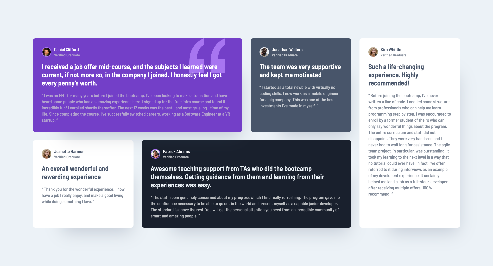

# Frontend Mentor - Testimonials grid section solution

This is a solution to the [Testimonials grid section challenge on Frontend Mentor](https://www.frontendmentor.io/challenges/testimonials-grid-section-Nnw6J7Un7). Frontend Mentor challenges help you improve your coding skills by building realistic projects. 

## Table of contents

- [Overview](#overview)
  - [The challenge](#the-challenge)
  - [Screenshot](#screenshot)
  - [Links](#links)
- [My process](#my-process)
  - [Built with](#built-with)
  - [What I learned](#what-i-learned)
  - [Continued development](#continued-development)
- [Author](#author)

## Overview

### The challenge

Users should be able to:

- View the optimal layout for the site depending on their device's screen size

### Screenshot

### Links

- Solution URL: (https://github.com/Anikhe00/Testimonial-Cards)
- Live Site URL: (https://testimonial-cards-omega.vercel.app/)

## My process

### Built with

- Semantic HTML5 markup
- CSS custom properties
- CSS Grid
- Mobile-first workflow

### What I learned

I learned about CSS Grid and it row, column, and span properties.

### Continued development

Moving forward I will be practicing developing this layout using grid-template-areas and how to customize it.

## Author

- Website - [Shakirat Akanji](https://shakeerah.framer.website/)
- Frontend Mentor - [@Anikhe00](https://www.frontendmentor.io/profile/Anikhe00)
- Twitter - [@i_am_anikhe](https://x.com/I_am_anikhe)

